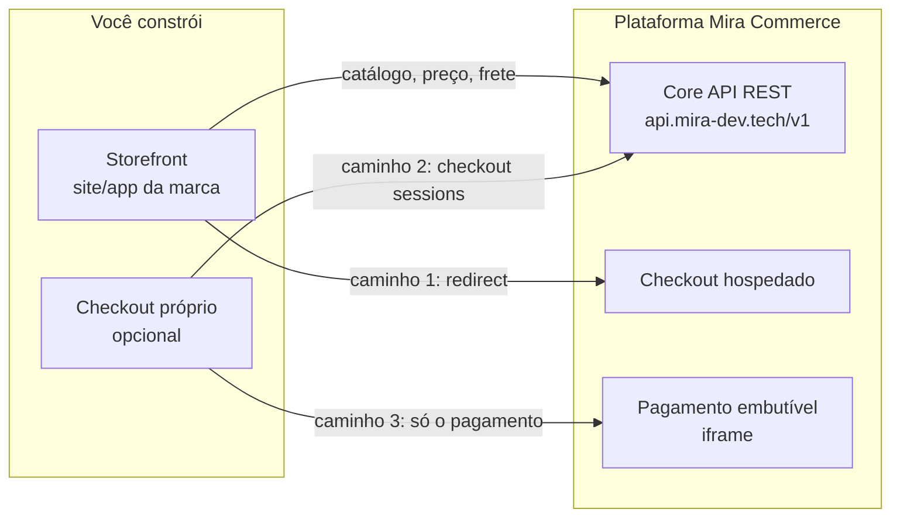

# Construindo um storefront para o Mira Commerce

Guia oficial para criar a **loja (vitrine + checkout)** da sua marca em cima da
plataforma [Mira Commerce](https://mira-dev.tech), consumindo as APIs REST da
plataforma. Você é dono de 100% da experiência do comprador; catálogo, preço,
estoque, pedido, pagamento e antifraude são autoritativos no core da
plataforma.



## Os três caminhos — escolha o seu

| Caminho | Você constrói | A plataforma cuida de | Esforço |
|---------|---------------|------------------------|---------|
| **1. Checkout hospedado** | Só a vitrine | Todo o checkout, identidade, pagamento, antifraude | ⭐ |
| **2. Checkout headless** | Vitrine + checkout completo | Validação, pedido, pagamento (via API) | ⭐⭐⭐ |
| **3. Checkout próprio + pagamento embutido** | Vitrine + carrinho/identidade/entrega | Só a etapa de pagamento (iframe, PCI incluso) | ⭐⭐ |

Recomendação: comece pelo **caminho 1** (vitrine no ar em dias), evolua para o
**3** quando quiser controlar a UX do funil, e vá ao **2** apenas se precisar
de um funil 100% proprietário (app nativo, WhatsApp, ERP).

## Pré-requisitos (recebidos no onboarding)

| Item | Exemplo | Público? |
|------|---------|----------|
| **URL da API** | `https://api.mira-dev.tech` | Sim |
| **`member_id`** — identifica sua loja (tenant) | `550e8400-e29b-41d4-...` | Sim — vai no header `X-Tenant-ID` |
| **Token de integrador** | `mc_test_…` (sandbox) / `mc_live_…` (produção) | **NÃO — só server-side/build** |

> Ainda não tem credenciais? Entre em contato com a equipe Mirá — o onboarding
> provisiona sua loja, banco de dados e tokens de sandbox.

## Quickstart — 3 chamadas e você viu a plataforma funcionar

```bash
export API=https://api.mira-dev.tech/v1
export TOKEN=mc_test_SEU_TOKEN
export MEMBER=SEU_MEMBER_ID

# 1. Listar o catálogo da sua loja
curl -s "$API/products?limit=5" \
  -H "Authorization: Bearer $TOKEN" -H "X-Tenant-ID: $MEMBER"

# 2. Resolver preço e estoque de um SKU
curl -s "$API/prices/resolve?sku=SKU-001&channel=web" \
  -H "Authorization: Bearer $TOKEN" -H "X-Tenant-ID: $MEMBER"

# 3. Abrir uma sessão de checkout (a base do caminho 2)
curl -s -X POST "$API/checkout/sessions" \
  -H "X-Tenant-ID: $MEMBER" -H "Content-Type: application/json" \
  -d '{"member_id":"'$MEMBER'","channel":"web","state":{"cart":[]}}'
```

## Mapa do guia

| Doc | O que ensina |
|-----|--------------|
| [01 — Autenticação e tenancy](docs/01-autenticacao.md) | Os 3 tipos de credencial, o header `X-Tenant-ID`, sandbox vs produção, a regra do BFF |
| [02 — Catálogo, preço e estoque](docs/02-catalogo.md) | Produtos, SKUs, resolução de preço, frete — a matéria-prima da vitrine |
| [03 — Checkout headless](docs/03-checkout.md) | Sessões de checkout de ponta a ponta: carrinho → identidade → place-order |
| [04 — Pagamento](docs/04-pagamento.md) | Redirect hospedado, iframe embutido (com 3DS in-page) e método offline para testes |
| [05 — Storefront estático com Next.js](docs/05-storefront-estatico-nextjs.md) | O padrão que usamos em produção: static export, envs, build e deploy |

## As 5 regras de segurança (não negociáveis)

1. **Token de integrador (`mc_…`) nunca chega ao browser** — só em código
   server-side ou build. No front, use BFF ou dados baked no build estático.
2. **`member_id` é público** — pode ir em `NEXT_PUBLIC_*`; ele identifica, não
   autentica.
3. **Nunca capture PAN/CVV de cartão** — o pagamento acontece no checkout
   hospedado ou no iframe embutido (PCI SAQ A fica conosco).
4. **`Idempotency-Key` em toda chamada que cria pedido ou cobra** — retry
   seguro em rede móvel.
5. **Erros de pagamento (402/409/429) viram mensagem genérica** para o
   comprador — nunca o detalhe técnico.

## Suporte

Dúvidas e sugestões sobre este guia: abra uma issue aqui. Credenciais,
onboarding e ambiente de sandbox: fale com a equipe Mirá.
