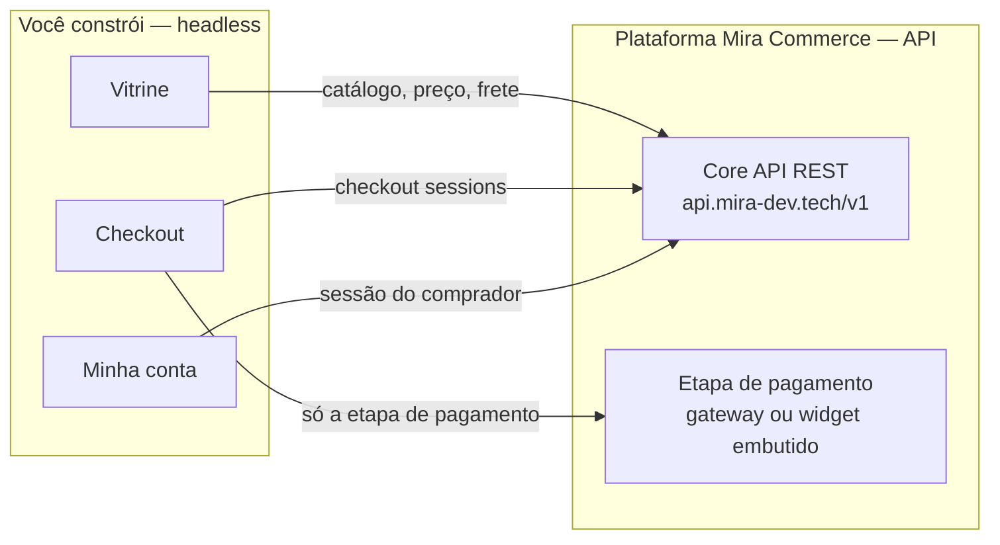

# Construindo um storefront para o Mira Commerce

Guia oficial para construir a **experiência completa de loja** — vitrine,
checkout e área do cliente ("minha conta") — em cima da plataforma
[Mira Commerce](https://mira-dev.tech).

O modelo é **headless por definição**: o front é 100% seu (seu código, seu
domínio, sua UX); catálogo, preço, estoque, pedido, pagamento, antifraude e
identidade do comprador são autoritativos no core da plataforma, consumidos
por API REST.



## O que você constrói × o que a plataforma garante

| Superfície | Você constrói | A plataforma garante (via API) |
|------------|---------------|--------------------------------|
| **Vitrine** | Páginas, navegação, busca, UX | Catálogo, preço resolvido, estoque, frete |
| **Checkout** | O funil inteiro (carrinho → identidade → fechamento) | Validação, recálculo de totais, criação/submit do pedido, antifraude, regras da loja |
| **Pagamento** | A tela onde a etapa acontece | Cobrança via gateway (redirect) ou widget embutido com 3DS — **PAN/CVV nunca passam pelo seu código** |
| **Minha conta** | Login, "meus pedidos", perfil | Identidade do comprador (magic-link), sessão, histórico de pedidos |

## Pré-requisitos (recebidos no onboarding)

| Item | Exemplo | Público? |
|------|---------|----------|
| **URL da API** | `https://api.mira-dev.tech` | Sim |
| **`member_id`** — identifica sua loja (tenant) | `550e8400-e29b-41d4-...` | Sim — vai no header `X-Tenant-ID` |
| **Token de integrador** | `mc_test_…` (sandbox) / `mc_live_…` (produção) | **NÃO — só server-side/build** |

> Ainda não tem credenciais? Entre em contato com a equipe Mirá — o onboarding
> provisiona sua loja, banco de dados e tokens de sandbox.

## Quickstart — 3 chamadas e você viu a plataforma funcionar

```bash
export API=https://api.mira-dev.tech/v1
export TOKEN=mc_test_SEU_TOKEN
export MEMBER=SEU_MEMBER_ID

# 1. Listar o catálogo da sua loja
curl -s "$API/products?limit=5" \
  -H "Authorization: Bearer $TOKEN" -H "X-Tenant-ID: $MEMBER"

# 2. Resolver preço e estoque de um SKU
curl -s "$API/prices/resolve?sku=SKU-001&channel=web" \
  -H "Authorization: Bearer $TOKEN" -H "X-Tenant-ID: $MEMBER"

# 3. Abrir uma sessão de checkout (a espinha dorsal do seu funil)
curl -s -X POST "$API/checkout/sessions" \
  -H "X-Tenant-ID: $MEMBER" -H "Content-Type: application/json" \
  -d '{"member_id":"'$MEMBER'","channel":"web","state":{"cart":[]}}'
```

## Mapa do guia (a jornada completa, em ordem)

| Doc | O que ensina |
|-----|--------------|
| [01 — Autenticação e tenancy](docs/01-autenticacao.md) | Os 3 tipos de credencial, o header `X-Tenant-ID`, sandbox vs produção, a regra do BFF |
| [02 — Catálogo, preço e estoque](docs/02-catalogo.md) | Produtos, SKUs, resolução de preço, frete — a matéria-prima da vitrine |
| [03 — Checkout headless](docs/03-checkout.md) | Sessões de checkout de ponta a ponta: carrinho → identidade → place-order |
| [04 — Pagamento](docs/04-pagamento.md) | As opções da etapa de pagamento: redirect ao gateway, widget embutido (3DS in-page) e offline para testes |
| [05 — Storefront estático com Next.js](docs/05-storefront-estatico-nextjs.md) | O padrão de produção da vitrine: static export, envs, build e deploy |
| [06 — Minha conta](docs/06-minha-conta.md) | Login do comprador por magic-link, sessão, "meus pedidos" e perfil |
| [07 — SDKs TypeScript](docs/07-sdk-typescript.md) | Tudo acima com tipos: `@mira/commerce-client-sdk` + helpers de checkout |

## As 5 regras de segurança (não negociáveis)

1. **Token de integrador (`mc_…`) nunca chega ao browser** — só em código
   server-side ou build. No front, use BFF ou dados baked no build estático.
2. **`member_id` é público** — pode ir em `NEXT_PUBLIC_*`; ele identifica, não
   autentica.
3. **Nunca capture PAN/CVV de cartão** — a etapa de pagamento acontece no
   gateway ou no widget embutido (PCI SAQ A fica conosco).
4. **`Idempotency-Key` em toda chamada que cria pedido ou cobra** — retry
   seguro em rede móvel.
5. **Erros de pagamento (402/409/429) viram mensagem genérica** para o
   comprador — nunca o detalhe técnico.

## Suporte

Dúvidas e sugestões sobre este guia: abra uma issue aqui. Credenciais,
onboarding e ambiente de sandbox: fale com a equipe Mirá.
